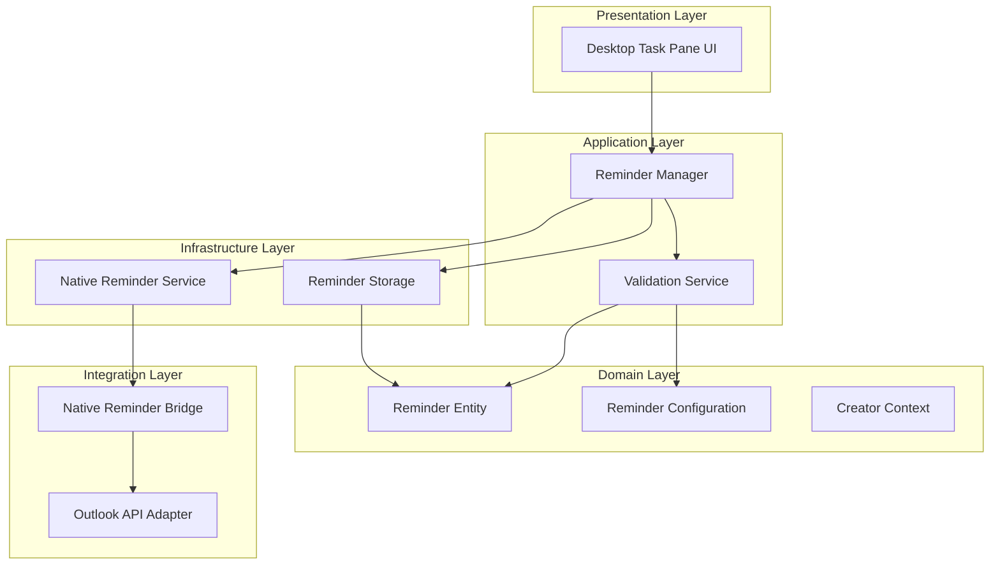
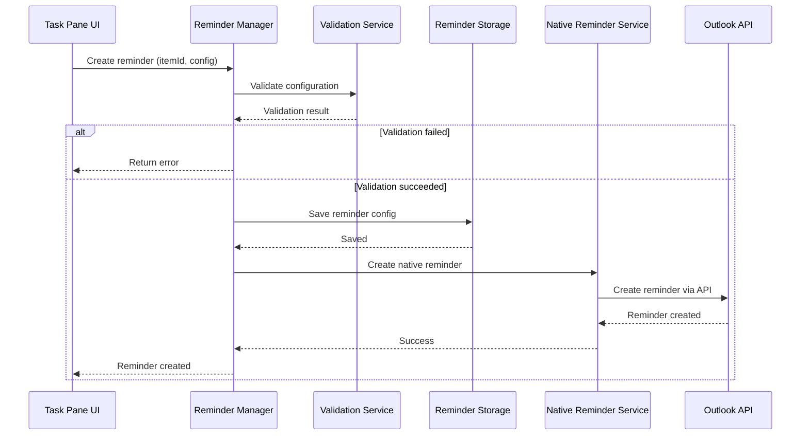

# Design Document: Outlook Multiple Alerts

## Overview

The Outlook Multiple Alerts Add-in extends Outlook Desktop's native reminder functionality to support up to 5 independent reminders per calendar event or task. Reminders are created only by the event/task organizer and delivered through Outlook's native reminder system. The key architectural challenge is managing reminder configurations and synchronizing them with native Outlook reminders.

### Key Design Principles

1. **Creator-Only**: Only the event/task creator can configure reminders, which are delivered only to them
2. **Native Integration**: All reminders are implemented as native Outlook reminders
3. **Desktop-Focused**: Single-platform implementation for Outlook Desktop (Windows and Mac)
4. **Non-Interference**: Add-in reminders coexist with existing native Outlook reminders without conflict
5. **Reliability First**: Reminder configurations use persistent storage with integrity verification

### Architecture Overview

The system follows a layered architecture:

- **Presentation Layer**: Desktop UI components (Task Pane)
- **Application Layer**: Reminder management logic and validation
- **Domain Layer**: Core reminder entities and business rules
- **Infrastructure Layer**: Storage and native Outlook reminder integration
- **Integration Layer**: Outlook API adapters and native reminder bridge

## Architecture

### Component Architecture



### Reminder Creation Flow



## Components and Interfaces

### Reminder Manager

The Reminder Manager is the central orchestrator for all reminder operations.

**Responsibilities:**
- Validate reminder configurations
- Enforce 5-reminder limit per item
- Coordinate with storage and native reminder service
- Handle reminder lifecycle (create, read, update, delete)

**Interface:**
```typescript
interface IReminderManager {
  // Create a new reminder for an item
  createReminder(itemId: string, config: ReminderConfiguration): Result<Reminder, ValidationError>;
  
  // Get all reminders for an item
  getReminders(itemId: string): Reminder[];
  
  // Update an existing reminder
  updateReminder(reminderId: string, config: ReminderConfiguration): Result<Reminder, ValidationError>;
  
  // Delete a reminder
  deleteReminder(reminderId: string): Result<void, Error>;
  
  // Delete all reminders when item is deleted
  deleteRemindersForItem(itemId: string): Result<void, Error>;
  
  // Validate reminder count doesn't exceed limit
  validateReminderLimit(itemId: string): Result<void, LimitExceededError>;
}
```

### Reminder Storage

Persistent storage for reminder configurations.

**Interface:**
```typescript
interface IReminderStorage {
  // Store reminder
  save(reminder: Reminder): Promise<void>;
  
  // Retrieve reminders for item
  getByItem(itemId: string): Promise<Reminder[]>;
  
  // Delete reminders by various criteria
  deleteByReminderId(reminderId: string): Promise<void>;
  deleteByItem(itemId: string): Promise<void>;
  
  // Verify data integrity
  verifyIntegrity(): Promise<IntegrityReport>;
}
```

### Native Reminder Service

Handles creation and management of native Outlook reminders.

**Interface:**
```typescript
interface INativeReminderService {
  // Create native Outlook reminder
  createNativeReminder(itemId: string, config: ReminderConfiguration): Promise<Result<string, ReminderError>>;
  
  // Update native Outlook reminder
  updateNativeReminder(nativeReminderId: string, config: ReminderConfiguration): Promise<Result<void, ReminderError>>;
  
  // Delete native Outlook reminder
  deleteNativeReminder(nativeReminderId: string): Promise<Result<void, ReminderError>>;
  
  // Get all native reminders for an item
  getNativeReminders(itemId: string): Promise<NativeReminder[]>;
}
```

### Outlook API Adapter

Platform-specific integration with Outlook APIs.

**Interface:**
```typescript
interface IOutlookAdapter {
  // Get calendar event or task details
  getItem(itemId: string): Promise<CalendarItem | Task>;
  
  // Get creator for calendar event or task
  getCreator(itemId: string): Promise<Creator>;
  
  // Get native reminders for item
  getNativeReminders(itemId: string): Promise<NativeReminder[]>;
  
  // Listen for item changes
  onItemChanged(callback: (itemId: string) => void): void;
  
  // Listen for item deletion
  onItemDeleted(callback: (itemId: string) => void): void;
  
  // Create native reminder via Outlook API
  createReminder(itemId: string, minutesBeforeStart: number): Promise<string>;
  
  // Update native reminder via Outlook API
  updateReminder(reminderId: string, minutesBeforeStart: number): Promise<void>;
  
  // Delete native reminder via Outlook API
  deleteReminder(reminderId: string): Promise<void>;
}
```

## Data Models

### Reminder Entity

```typescript
interface Reminder {
  // Unique identifier for the reminder configuration
  id: string;
  
  // Associated calendar event or task ID
  itemId: string;
  
  // Type of item (event or task)
  itemType: 'event' | 'task';
  
  // Reminder configuration
  configuration: ReminderConfiguration;
  
  // Native Outlook reminder ID
  nativeReminderId: string;
  
  // Metadata
  createdAt: Date;
  updatedAt: Date;
}
```

### Reminder Configuration

```typescript
interface ReminderConfiguration {
  // Time offset from event/task (in minutes)
  // Negative values mean before the event
  timeOffset: number; // e.g., -15 for 15 minutes before
  
  // Computed trigger time (calculated from item date + offset)
  triggerTime: Date;
}
```

### Creator Context

```typescript
interface Creator {
  // Creator identifier
  id: string;
  
  // Creator email address
  email: string;
}
```

### Calendar Item

```typescript
interface CalendarItem {
  id: string;
  title: string;
  startTime: Date;
  endTime: Date;
  creatorId: string;
  nativeReminders: NativeReminder[];
}
```

### Task

```typescript
interface Task {
  id: string;
  title: string;
  dueDate?: Date;
  creatorId: string;
  nativeReminders: NativeReminder[];
}
```

### Native Reminder

```typescript
interface NativeReminder {
  id: string;
  minutesBeforeStart: number;
  isAddInManaged: boolean; // true if created by this add-in
}
```

### Validation Error Types

```typescript
type ValidationError = 
  | { type: 'limit_exceeded'; message: string; currentCount: number }
  | { type: 'invalid_time'; message: string; providedTime: Date }
  | { type: 'invalid_offset'; message: string; providedOffset: number }
  | { type: 'item_not_found'; message: string; itemId: string }
  | { type: 'not_creator'; message: string; itemId: string };

type ReminderError =
  | { type: 'creation_failed'; message: string; itemId: string }
  | { type: 'update_failed'; message: string; reminderId: string }
  | { type: 'deletion_failed'; message: string; reminderId: string };
```


## Correctness Properties

*A property is a characteristic or behavior that should hold true across all valid executions of a system—essentially, a formal statement about what the system should do. Properties serve as the bridge between human-readable specifications and machine-verifiable correctness guarantees.*

### Property Reflection

After analyzing all acceptance criteria, the following properties represent the unique, non-redundant validation requirements for the simplified Desktop-only reminder system:

### Property 1: Reminder Limit Per Item

*For any* calendar item (event or task), the number of reminders configured for that item should never exceed 5.

**Validates: Requirements 1.1**

### Property 2: Reminder Storage Round Trip

*For any* reminder created for an item, storing and then retrieving reminders for that item should return a reminder with equivalent configuration.

**Validates: Requirements 1.3**

### Property 3: Item Deletion Cascades to All Reminders

*For any* calendar item with configured reminders, deleting the item should result in all reminder configurations and native Outlook reminders being removed.

**Validates: Requirements 1.4**

### Property 4: Past Reminder Time Validation

*For any* reminder configuration where the computed trigger time is in the past relative to the current time, validation should fail and reject the configuration.

**Validates: Requirements 3.3**

### Property 5: Native Reminder Creation

*For any* valid reminder configuration, creating the reminder should result in a corresponding native Outlook reminder being created.

**Validates: Requirements 4.1, 4.2**

### Property 6: Native Reminder Update Synchronization

*For any* reminder update operation, modifying the reminder configuration should result in the corresponding native Outlook reminder being updated with the new time.

**Validates: Requirements 4.4**

### Property 7: Native Reminder Deletion Synchronization

*For any* reminder deletion operation, deleting the reminder should result in the corresponding native Outlook reminder being removed.

**Validates: Requirements 4.3**

### Property 8: Reminder Retrieval Returns All Item Reminders

*For any* calendar item, retrieving reminders should return all reminders configured for that item.

**Validates: Requirements 5.1**

### Property 9: Reminder Update Validation

*For any* reminder update operation with invalid configuration (e.g., past trigger time, exceeds limit), the update should be rejected and the reminder should remain unchanged.

**Validates: Requirements 5.4**

### Property 10: Chronological Reminder Ordering

*For any* set of reminders retrieved for an item, the reminders should be ordered by trigger time from earliest to latest.

**Validates: Requirements 5.5**

### Property 11: Native Reminder Preservation

*For any* calendar item with existing native Outlook reminders not created by the add-in, any add-in operations (create, update, delete add-in reminders) should not modify or remove those existing native reminders.

**Validates: Requirements 6.1, 6.3**

### Property 12: Integrity Verification Detects Corruption

*For any* reminder storage containing corrupted data (invalid references, missing required fields), the integrity verification function should detect and report the corruption.

**Validates: Requirements 7.1, 7.2**


## Error Handling

### Error Categories

The system handles three primary categories of errors:

1. **Validation Errors**: Invalid user input or configuration
2. **Native Reminder Errors**: Failures when creating/updating/deleting native Outlook reminders
3. **Data Integrity Errors**: Corrupted or inconsistent storage

### Validation Error Handling

**Strategy**: Fail fast with clear error messages

- Reminder limit exceeded: Return error immediately, prevent creation
- Invalid trigger time: Return error with specific time validation failure
- Item not found: Return error when item doesn't exist

**Implementation**:
```typescript
class ReminderValidator {
  validate(itemId: string, config: ReminderConfiguration): Result<void, ValidationError> {
    // Check reminder limit
    const currentCount = this.storage.getByItem(itemId).length;
    if (currentCount >= 5) {
      return Err({ type: 'limit_exceeded', message: 'Maximum 5 reminders per item', currentCount });
    }
    
    // Check trigger time is in future
    if (config.triggerTime < new Date()) {
      return Err({ type: 'invalid_time', message: 'Reminder time must be in the future', providedTime: config.triggerTime });
    }
    
    return Ok(void);
  }
}
```

### Native Reminder Error Handling

**Strategy**: Log errors and notify user, provide retry option

- Creation failures: Log error, notify creator, allow retry
- Update failures: Log error, notify creator, allow retry
- Deletion failures: Log error, notify creator, allow manual cleanup

**Implementation**:
```typescript
class NativeReminderService {
  async createNativeReminder(itemId: string, config: ReminderConfiguration): Promise<Result<string, ReminderError>> {
    try {
      const minutesBeforeStart = Math.abs(config.timeOffset);
      const nativeReminderId = await this.outlookAdapter.createReminder(itemId, minutesBeforeStart);
      return Ok(nativeReminderId);
    } catch (error) {
      this.errorLog.log({
        type: 'native_reminder_creation',
        severity: 'high',
        itemId,
        message: error.message,
        timestamp: new Date()
      });
      return Err({ type: 'creation_failed', message: error.message, itemId });
    }
  }
  
  async updateNativeReminder(nativeReminderId: string, config: ReminderConfiguration): Promise<Result<void, ReminderError>> {
    try {
      const minutesBeforeStart = Math.abs(config.timeOffset);
      await this.outlookAdapter.updateReminder(nativeReminderId, minutesBeforeStart);
      return Ok(void);
    } catch (error) {
      this.errorLog.log({
        type: 'native_reminder_update',
        severity: 'high',
        reminderId: nativeReminderId,
        message: error.message,
        timestamp: new Date()
      });
      return Err({ type: 'update_failed', message: error.message, reminderId: nativeReminderId });
    }
  }
}
```

### Data Integrity Error Handling

**Strategy**: Detect on startup, provide recovery options

- Orphaned reminders: Reminder configurations referencing non-existent items
- Invalid references: Reminder itemId that cannot be resolved
- Corrupted configuration: Missing required fields or invalid values
- Orphaned native reminders: Native reminders without corresponding configuration

**Recovery Options**:
1. Auto-repair: Fix minor issues (e.g., normalize timestamps)
2. Quarantine: Move corrupted reminders to separate storage for manual review
3. Delete: Remove reminders that cannot be repaired (with creator confirmation)

**Implementation**:
```typescript
class IntegrityVerifier {
  async verify(): Promise<IntegrityReport> {
    const allReminders = await this.storage.getAllReminders();
    const issues: IntegrityIssue[] = [];
    
    for (const reminder of allReminders) {
      // Check item exists
      const item = await this.outlookAdapter.getItem(reminder.itemId);
      if (!item) {
        issues.push({
          type: 'orphaned_reminder',
          reminderId: reminder.id,
          severity: 'high',
          autoRepairable: false,
          suggestedAction: 'delete'
        });
        continue;
      }
      
      // Check native reminder exists
      const nativeReminders = await this.outlookAdapter.getNativeReminders(reminder.itemId);
      const nativeExists = nativeReminders.some(nr => nr.id === reminder.nativeReminderId);
      if (!nativeExists) {
        issues.push({
          type: 'missing_native_reminder',
          reminderId: reminder.id,
          severity: 'high',
          autoRepairable: true,
          suggestedAction: 'recreate_native'
        });
      }
    }
    
    return { totalReminders: allReminders.length, issues };
  }
  
  async repair(report: IntegrityReport): Promise<RepairResult> {
    const repaired: string[] = [];
    const deleted: string[] = [];
    
    for (const issue of report.issues) {
      if (issue.autoRepairable && issue.suggestedAction === 'recreate_native') {
        const reminder = await this.storage.getById(issue.reminderId);
        await this.nativeReminderService.createNativeReminder(reminder.itemId, reminder.configuration);
        repaired.push(issue.reminderId);
      } else if (issue.suggestedAction === 'delete') {
        await this.storage.deleteByReminderId(issue.reminderId);
        deleted.push(issue.reminderId);
      }
    }
    
    return { repaired, deleted };
  }
}
```

### Error Logging

All errors are logged with structured data for troubleshooting:

```typescript
interface ErrorLogEntry {
  timestamp: Date;
  type: 'validation' | 'native_reminder' | 'integrity';
  severity: 'low' | 'medium' | 'high' | 'critical';
  reminderId?: string;
  itemId?: string;
  message: string;
  details: Record<string, any>;
  stackTrace?: string;
}
```

## Testing Strategy

### Dual Testing Approach

The testing strategy employs both unit tests and property-based tests to achieve comprehensive coverage:

- **Unit tests**: Verify specific examples, edge cases, and error conditions
- **Property-based tests**: Verify universal properties across all inputs

These approaches are complementary. Unit tests catch concrete bugs in specific scenarios, while property-based tests verify general correctness across a wide range of inputs.

### Unit Testing

Unit tests focus on:

1. **Specific Examples**: Concrete scenarios that demonstrate correct behavior
   - Creating a reminder with valid configuration succeeds
   - Retrieving reminders for a specific item returns expected results
   - Deleting an item removes associated reminders and native reminders

2. **Edge Cases**: Boundary conditions and special cases
   - Adding 6th reminder is rejected (limit enforcement)
   - Reminder trigger time exactly at current time
   - Item with no due date (tasks)

3. **Error Conditions**: Specific error scenarios
   - Native Outlook API returns error when creating reminder
   - Corrupted JSON in storage
   - Item not found when creating reminder

4. **Integration Points**: Component interactions
   - Reminder Manager coordinating with Storage and Native Reminder Service
   - Outlook Adapter handling item deletion events
   - Integrity Verifier detecting and repairing orphaned reminders

**Example Unit Tests**:
```typescript
describe('ReminderManager', () => {
  it('should create reminder with valid configuration', async () => {
    const manager = new ReminderManager(storage, validator, nativeService);
    const config = {
      timeOffset: -15,
      triggerTime: new Date(Date.now() + 3600000)
    };
    
    const result = await manager.createReminder('item1', config);
    
    expect(result.isOk()).toBe(true);
    expect(result.value.itemId).toBe('item1');
  });
  
  it('should reject 6th reminder for same item', async () => {
    // Create 5 reminders first
    for (let i = 0; i < 5; i++) {
      await manager.createReminder('item1', validConfig);
    }
    
    const result = await manager.createReminder('item1', validConfig);
    
    expect(result.isErr()).toBe(true);
    expect(result.error.type).toBe('limit_exceeded');
  });
});
```

### Property-Based Testing

Property-based tests verify universal properties using randomized inputs. Each test runs a minimum of 100 iterations to ensure comprehensive coverage.

**Property Testing Library**: Use `fast-check` for TypeScript/JavaScript implementation.

**Configuration**:
```typescript
import * as fc from 'fast-check';

// Configure all property tests to run 100+ iterations
const propertyConfig = { numRuns: 100 };
```

**Test Tagging**: Each property test must reference its design document property:
```typescript
// Feature: outlook-multiple-alerts, Property 1: Reminder Limit Per Item
```

**Property Test Examples**:

```typescript
describe('Correctness Properties', () => {
  // Feature: outlook-multiple-alerts, Property 1: Reminder Limit Per Item
  it('Property 1: Reminder count never exceeds 5 per item', () => {
    fc.assert(
      fc.asyncProperty(
        fc.string(), // itemId
        fc.array(reminderConfigArbitrary(), { minLength: 0, maxLength: 10 }),
        async (itemId, configs) => {
          const manager = new ReminderManager(storage, validator, nativeService);
          
          // Try to create all reminders
          for (const config of configs) {
            await manager.createReminder(itemId, config);
          }
          
          // Verify count never exceeds 5
          const reminders = await storage.getByItem(itemId);
          expect(reminders.length).toBeLessThanOrEqual(5);
        }
      ),
      propertyConfig
    );
  });
  
  // Feature: outlook-multiple-alerts, Property 2: Reminder Storage Round Trip
  it('Property 2: Stored reminders can be retrieved with equivalent configuration', () => {
    fc.assert(
      fc.asyncProperty(
        fc.string(), // itemId
        reminderConfigArbitrary(),
        async (itemId, config) => {
          const manager = new ReminderManager(storage, validator, nativeService);
          
          // Create reminder
          const createResult = await manager.createReminder(itemId, config);
          if (createResult.isErr()) return; // Skip invalid configs
          
          // Retrieve reminders
          const reminders = await storage.getByItem(itemId);
          
          // Should find reminder with equivalent config
          const found = reminders.find(r => 
            r.configuration.timeOffset === config.timeOffset
          );
          expect(found).toBeDefined();
        }
      ),
      propertyConfig
    );
  });
  
  // Feature: outlook-multiple-alerts, Property 10: Chronological Reminder Ordering
  it('Property 10: Retrieved reminders are ordered by trigger time', () => {
    fc.assert(
      fc.asyncProperty(
        fc.string(), // itemId
        fc.array(reminderConfigArbitrary(), { minLength: 2, maxLength: 5 }),
        async (itemId, configs) => {
          const manager = new ReminderManager(storage, validator, nativeService);
          
          // Create reminders
          for (const config of configs) {
            await manager.createReminder(itemId, config);
          }
          
          // Retrieve reminders
          const reminders = await manager.getReminders(itemId);
          
          // Verify chronological ordering
          for (let i = 1; i < reminders.length; i++) {
            expect(reminders[i].configuration.triggerTime.getTime())
              .toBeGreaterThanOrEqual(reminders[i-1].configuration.triggerTime.getTime());
          }
        }
      ),
      propertyConfig
    );
  });
});
```

**Arbitrary Generators**:
```typescript
// Generator for valid reminder configurations
function reminderConfigArbitrary(): fc.Arbitrary<ReminderConfiguration> {
  return fc.record({
    timeOffset: fc.integer({ min: -10080, max: 0 }), // Up to 1 week before
    triggerTime: fc.date({ min: new Date(Date.now() + 60000) }) // At least 1 min in future
  });
}

// Generator for creators
function creatorArbitrary(): fc.Arbitrary<Creator> {
  return fc.record({
    id: fc.uuid(),
    email: fc.emailAddress()
  });
}
```

### Test Coverage Goals

- **Unit Test Coverage**: Minimum 80% code coverage
- **Property Test Coverage**: All 12 correctness properties implemented
- **Integration Test Coverage**: All component interfaces tested
- **End-to-End Test Coverage**: Critical user flows (create, update, delete)

### Testing Tools

- **Unit Testing**: Jest or Vitest
- **Property-Based Testing**: fast-check
- **Mocking**: Test doubles for Outlook API
- **Test Data**: Factory functions for creating test entities
- **Assertions**: Custom matchers for Result types and async operations

